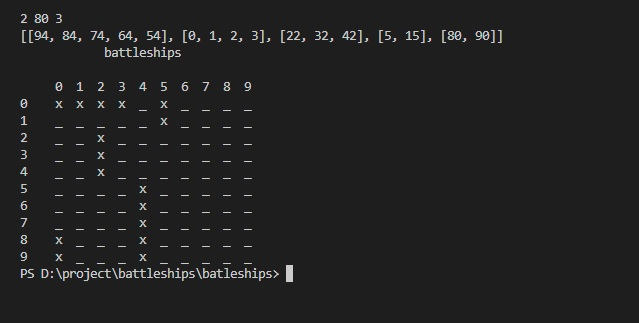
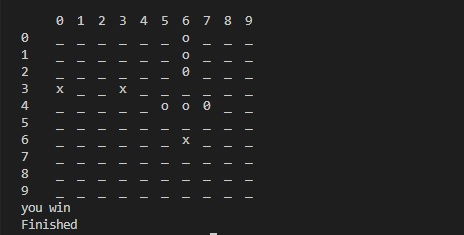
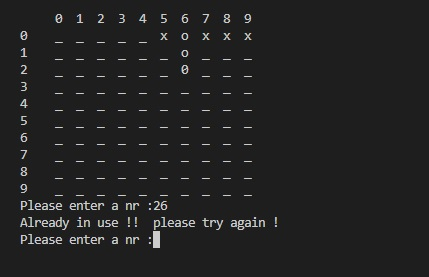

# Batleships game

Battleship game for pp3  project. 
Start making my very first pyton project. simple battleship game.

   
1. - For first step i creat the table, wich is a 10x10 grid, and add the function to write the hit,miss,and comp on the table.

2. - Creat a function for the user
   - Wich is an intriger because we need a nr not a letter/negativ etc. nr have to be between 0 and 99.
   - If the user enter incorrect fomrat: error message  show up " Incorrect!! please try again". 
     also have to check if the user enter was used before.

3. I creat 2 temporary ships. and in check shot also created  2 if statment. there was an error because the if statemnt check only one ship.so i made the 2 if statment in one.

4. - Creat  the ship.py  file. "creating the list of random boats , i used youtube tutorials 
     in this file i creat the random boat locations. using random imports.
     function added to check the boats positions.go through in each nr and check if is a valid nr.
     need to define the boats to be in one lane, (ex : 2,3,4,5  or 23,33,43,53)!i can exept boats only in the table , negativ nr not accepted.
     have to be separete if we have mor then  one ship, we dont use the same location for them,not crossing each other. -->
   - Creat on other list, "taken". add to chek_ok and to check_boat. 

1. - Our ships is a  lists of list.
   - The shot will be added to the list of misses if it hasn't hit any of the ships.

2. - Tactics added to the game. (followed by youtube totorials : (https://www.youtube.com/watch?v=LbALFZoRrw8) )
   
3. Creat player ships.same method ass the computer ship creating
   - computer creat a board for player1
  

[def]: ../assets/pictures/if_same_nr_error.jpg